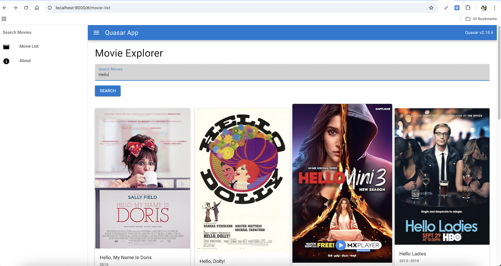
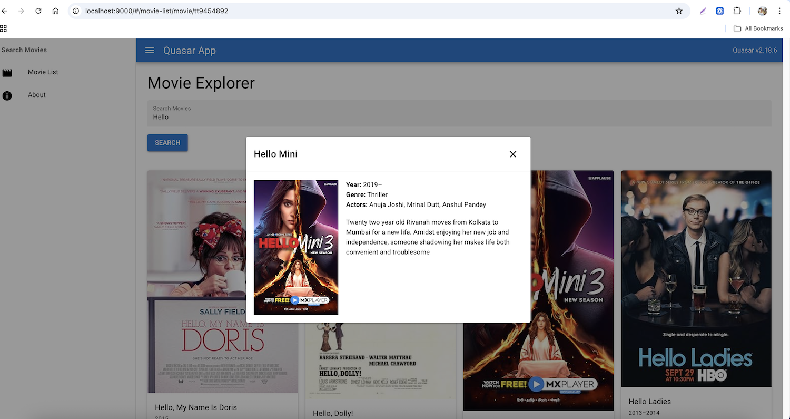
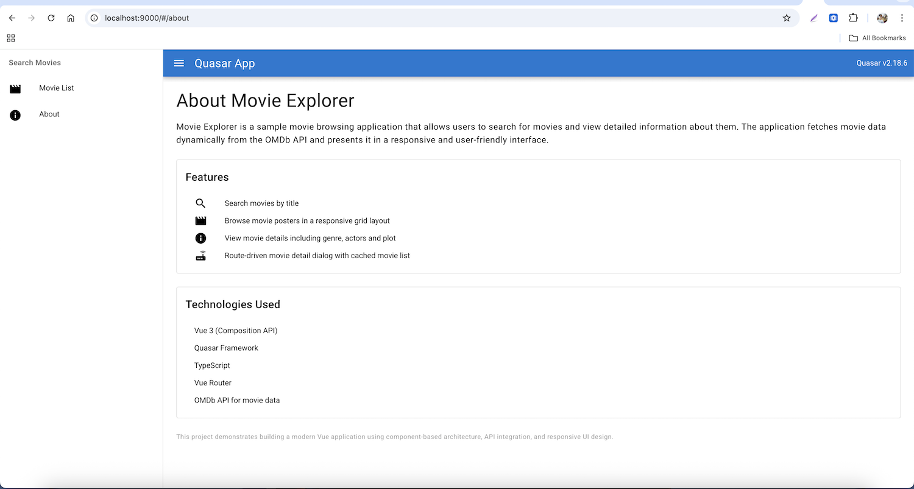
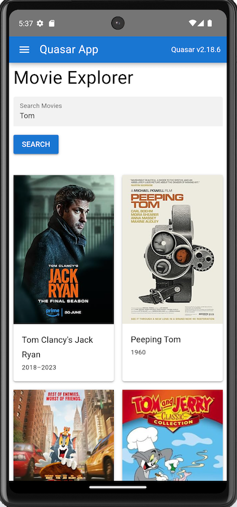
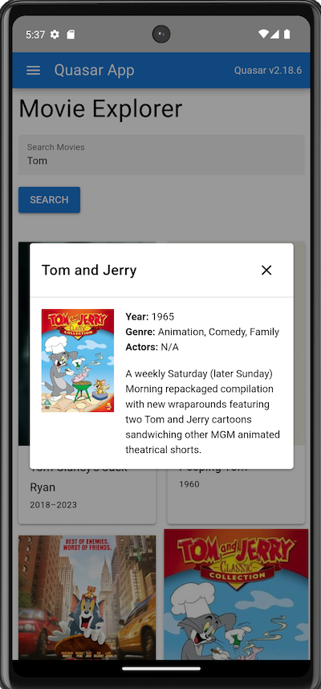
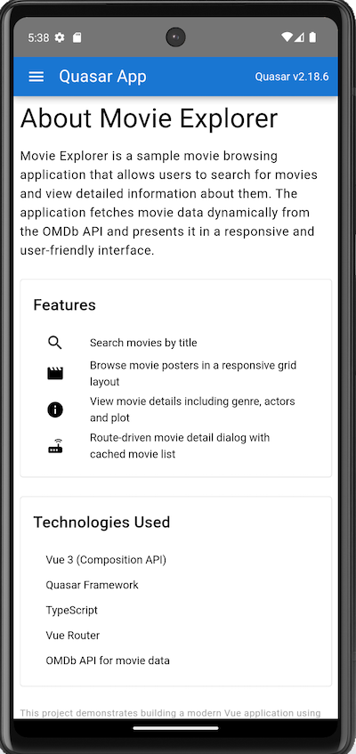
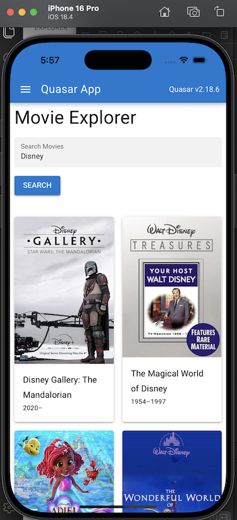
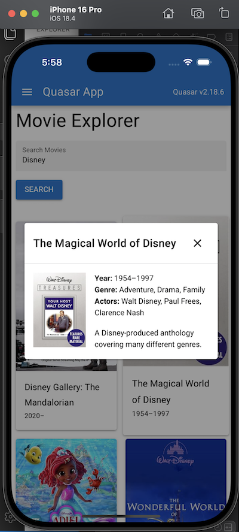
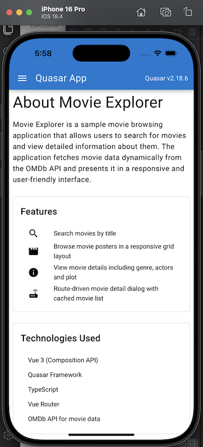

# Movie Search Quasar (movie-search-quasar)

A sample Movie Search application built using **Vue 3**, **Quasar Framework**, and **TypeScript**. The app fetches movie data from the **OMDb API** and demonstrates modern frontend architecture including Composition API, routing, dialogs, caching, and responsive UI.

---

## Features

- Vue 3 Composition API
- TypeScript support
- Quasar UI components
- Movie search using OMDb API
- Responsive movie grid layout
- Movie detail dialog with routing
- Image fallback handling
- Loading overlay during API calls
- Cached movie list (no reload when closing details)
- Scrollable movie plot section
- Mobile responsive design
- Optional Capacitor support for mobile apps

---

## Tech Stack

- Vue 3
- Quasar Framework
- TypeScript
- Vue Router
- Axios
- OMDb API
- Capacitor (optional for mobile build)

---

## Screenshots

**Web**





**Android**





**iOS**





---

## Android Apk

---

## Project Structure

```
src/
  api/
    movieService.ts

  boot/
    axios.ts

  components/
    DrawerItem.vue
    MovieCard.vue

  css/
    app.scss
    quasar.variables.scss

  dailog/
    MovieDetailDialog.vue

  layouts/
    MainLayout.vue

  pages/
    AboutPage.vue
    ErrorNotFound.vue
    MovieListPage.vue

  router/
    index.ts
    routes.ts

  types/
    movie.ts

   App/vue

src-capacitor/
  android/
  ios/

quasar.config.ts
```

---

## Installation

### 1. Clone the repository

```
git clone <repository-url>
cd movie-search-quasar
```

### 2. Install dependencies

```
npm install
```

### 3. Add your OMDb API key

Create or update the API service:

```
src/api/movieService.ts
```

Replace the key with your own:

```
const API_KEY_OM_DB = "YOUR_OMDB_API_KEY";
```

You can obtain a free key from:

[http://www.omdbapi.com/](http://www.omdbapi.com/)

---

## Run the Application

### Start development server

```
quasar dev
```

The app will start at:

```
http://localhost:9000
```

---

## Build for Production

```
quasar build
```

---

## Capacitor Mobile Build (Optional)

This project can also run as a **native mobile application** using Capacitor.

### Add Capacitor Mode

```
quasar mode add capacitor
```

This creates the folder:

```
src-capacitor/
```

---

### Android Build

Build the project for Android:

```
quasar build -m capacitor -T android
```

Sync the project:

```
cd src-capacitor
npx cap sync android
```

Open in Android Studio:

```
npx cap open android
```

Requirements:

- Node.js 20+
- Java 21
- Android Studio

---

### iOS Build

> iOS builds require macOS and Xcode.

Add the iOS platform:

```
cd src-capacitor
npx cap add ios
```

Build the Quasar app for iOS:

```
quasar build -m capacitor -T ios
```

Sync the project:

```
cd src-capacitor
npx cap sync ios
```

Open the project in Xcode:

```
npx cap open ios
```

Then run the project on:

- iPhone Simulator
- Physical iPhone device

Requirements:

- macOS
- Xcode (latest)
- CocoaPods

Install CocoaPods if needed:

```
sudo gem install cocoapods
```

If iOS dependencies fail to install:

```
cd src-capacitor/ios/App
pod install
```

---

### Development Mode (Live Reload)

Run the mobile app with hot reload:

Android:

```
quasar dev -m capacitor -T android
```

iOS:

```
quasar dev -m capacitor -T ios
```

---

## Application Pages

### Movie List Page

- Search movies
- Displays results in a responsive grid
- Shows loading overlay during API calls

### Movie Detail Dialog

- Opens using route navigation
- Displays poster, actors, genre, year, and plot

### About Page

Provides information about the application and technology stack.

---

## Responsive Design

Movie cards use a responsive grid:

```
col-6 col-sm-4 col-md-3 col-lg-2
```

Result:

- Mobile: 2 columns
- Tablet: 3 columns
- Desktop: 4–6 columns

---

## Image Handling

If the movie poster fails to load, a default image is displayed.

---

## Future Improvements

- Infinite scrolling
- Favorites / watchlist
- Movie ratings visualization
- Offline caching
- PWA support

---

## License

This project is for demonstration and learning purposes.

---

## Author

Rakesh Verma

Principal Software Engineer
